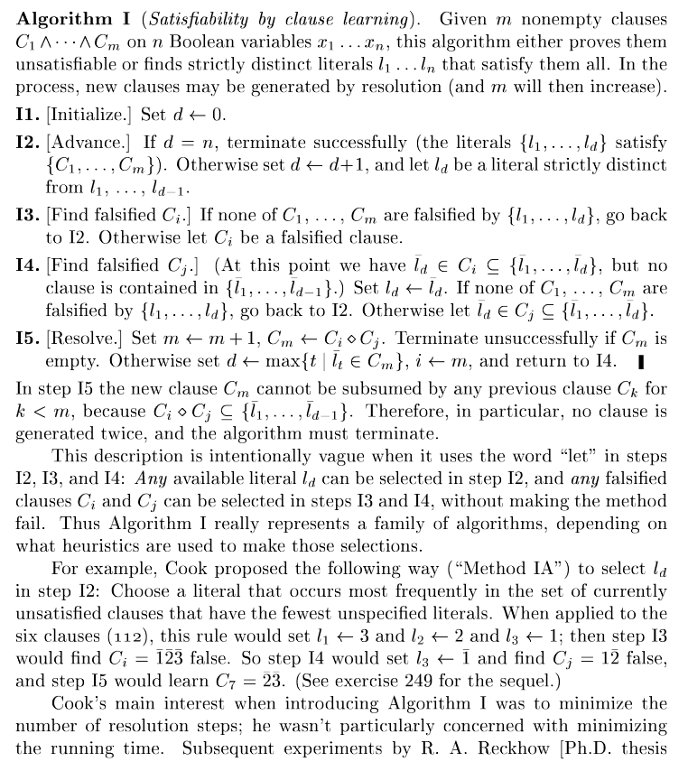

# Logic algorithms project

University project for logic algorithms.

## Exercise 1

Construct the 16 B2→B function shortest form, only with if-then-else operations and the T, ⊥ constants.

T: Tautology (TRUE)

⊥: Unsatisfactory formula (FALSE)

## Exercise 2

Implement the algorithm I (Knuth 7.2.2.2. page 61)

### Descriptions for the steps
#### I1
Initialize the clauses and the boolean variables.
#### I2
Select strictly distinct literal from x1, ..., xn
#### I3
Get the index of a falsified clause
#### I4
Try to negate ld, if this satisfies all the other claus too, then go to I2
If there is a falsified clause, then the index of the last clause
#### I5
Resolution

## Theorems
### Literal
A literal is an atomic formula or its negation.

For a literal *l*, the complementary literal is a literal corresponding to the negation of *l*.

### Strictly distinct literals
Two literals are strictly distinct if they are distinct and moreover they are not complementary one to the other. We say that a set of literals is strictly distinct if it does not contain two complementary literals.

The clauses values are indexes, if they are in absolute values. 
If the number is negative, then the values with that index should be false, if it's a positive number, then it should be true.

### Clause
In logic, a **clause** is an expression formed from a finite collection of literals (atoms or their negations). A clause is true either whenever at least one of the literals that form it is true (a disjunctive clause, the most common use of the term), or when all the literals that form it are true (a conjunctive clause, a less common use of the term).

### Resolution
The idea of Propositional Resolution is simple. Suppose we have the clause {p, q}. In other words, we know that p is true or q is true. Suppose we also have the clause {¬q, r}. In other words, we know that q is false or r is true. One clause contains q, and the other contains ¬q. If q is false, then by the first clause p must be true. If q is true, then, by the second clause, r must be true. Since q must be either true or false, then it must be the case that either p is true or r is true. So we should be able to derive the clause {p, r}.
